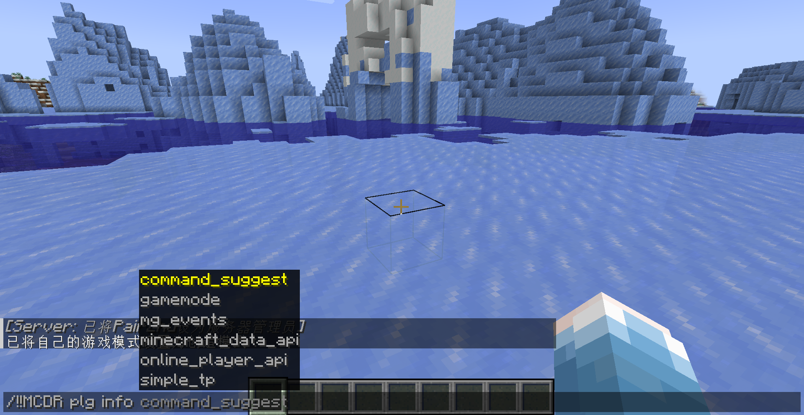

# 🚀 McdrCmdSuggest

**English | [简体中文](./README.md)**

## ✨ A More Elegant MCDR Command Completion

This mod requires the use of the [CommandSuggest](https://mcdreforged.com/zh-CN/plugin/command_suggest) plugin.

McdrCmdSuggest is a Fabric mod that provides a more elegant command completion experience for [MCDReforged](https://github.com/Fallen-Breath/MCDReforged). By registering MCDR commands on the Minecraft server and sending them to the client, players can enjoy a native command completion experience.

## 🛠️ Features

- ⚡ Native command completion: Registers MCDR commands as native Minecraft commands, allowing silent execution of MCDR commands.
- 💡 Supports argument suggestion completion (the `suggests` method in MCDR plugins).
- 🖥️ Pure server-side mod: No client installation required, compatible with vanilla clients.
- 🛡️ Does not rely on mixins, making it easier to maintain across multiple versions, with full support for official versions **1.14 ~ 1.21.8**.
- ⚙️ Fully automatic default configuration: Works out of the box without manual setup.

## 📦 Installation

1. Download the latest version of McdrCmdSuggest from [Modrinth](https://modrinth.com/mod/mcdrcmdsuggest) or [GitHub Releases](https://github.com/PairZhu/McdrCmdSuggest/releases).
2. Place the downloaded jar file into the `mods` folder of your Minecraft server.
3. Install the corresponding [MCDR plugin](https://mcdreforged.com/zh-CN/plugin/command_suggest) on the server.
4. Restart the server.

## 📝 Usage

Enter existing MCDR commands in the standard Minecraft command format starting with `/`, then use the Tab key in-game for command completion. For example, `/!!help`, `/!!MCDR xxx` (no need to configure other plugins or modify plugin code).

## 🔍 Comparison with Other Mods

Compared to other MCDR command completion mods, McdrCmdSuggest offers the following advantages:

- **More elegant implementation**: Directly utilizes Minecraft's native command system for a smoother user experience.
- **More comprehensive features**: Supports argument suggestion completion, suitable for more complex command structures.
- **Better compatibility**: MCDR commands can be completed even if they don't start with "!" or "!!", compatible with more plugins.
- **Fewer dependencies**: No mixin dependency, reducing potential maintenance costs, and no client mod required.

## 🧩 Technical Details

McdrCmdSuggest implements command completion as follows:

1. Registers a special command `__mcdrcmdsuggest_register` to receive command registration information from the server.
2. Dynamically registers Minecraft commands based on the received information.
3. If a command includes argument suggestions (`suggests`), a suggests method is added to query the corresponding MCDR plugin for suggestions (uses HTTP by default, only local communication between server and MCDR, no need to expose ports). Client suggestions are transmitted via Minecraft's native protocol.

## 🤝 Contributing

Issues and feature requests are welcome!

## 🙏 Acknowledgements

- [MCDReforged](https://github.com/Fallen-Breath/MCDReforged) - Powerful Minecraft server management framework.
- [ZhuRuoLing/MCDRCommandCompletionReforged-Mod](https://github.com/ZhuRuoLing/MCDRCommandCompletionReforged-Mod) - Provided reference implementation.
- [AnzhiZhang/MCDRCommandFabric](https://github.com/AnzhiZhang/MCDRCommandFabric) - Provided reference implementation.

## 📄 Statement

This mod heavily references the code and implementation of [ZhuRuoLing/MCDRCommandCompletionReforged-Mod](https://github.com/ZhuRuoLing/MCDRCommandCompletionReforged-Mod) and [AnzhiZhang/MCDRCommandFabric](https://github.com/AnzhiZhang/MCDRCommandFabric). Without their work, this mod would not have been possible.